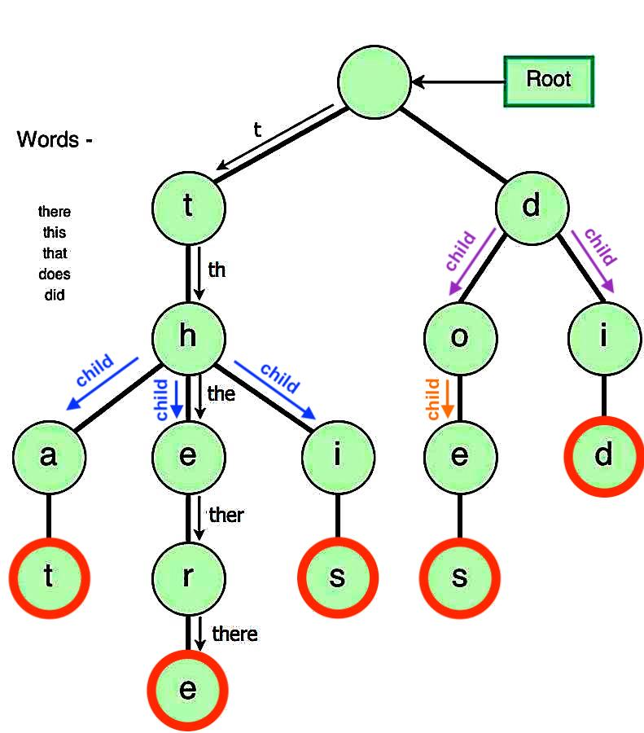
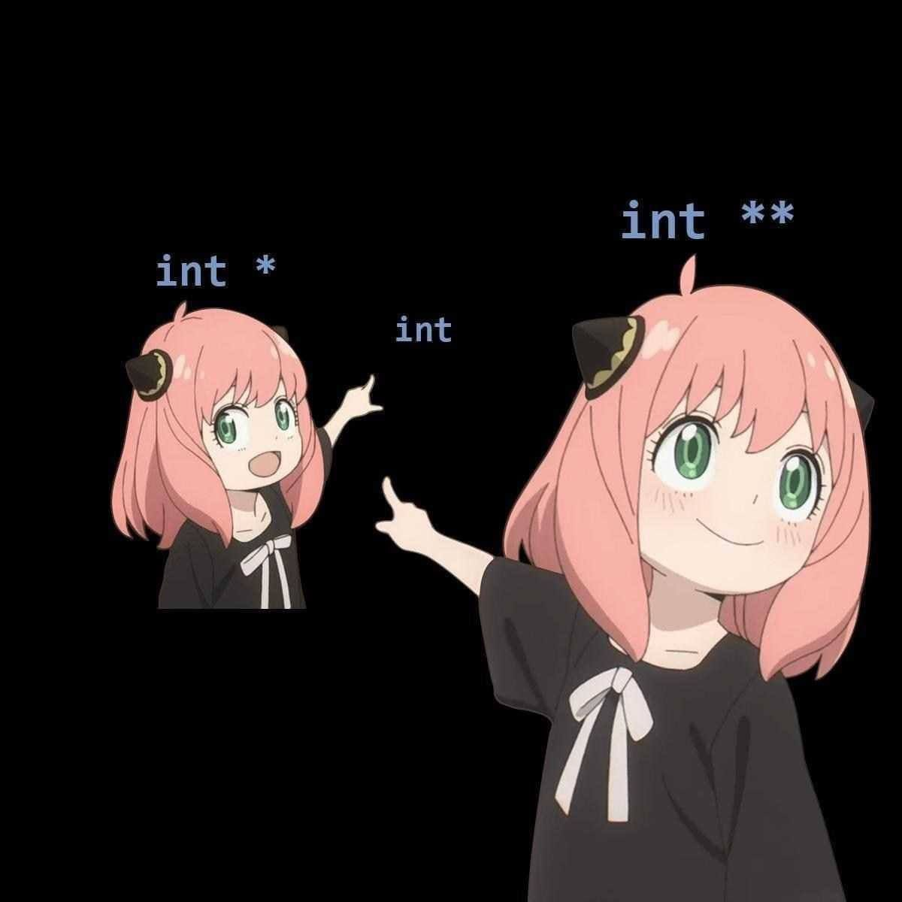

# Advanced Programming Course - HW2
<p  align="center"> <b>Homework 2 - Fall 2022 Semester <br> Deadline: Shanbe 21 Aban - 11:59 pm</b> </p>

</br>

## Outline

In this homework, we are going to implement a structure called ***Trie***. A Trie is a structure to store different strings with a very powerful and optimized search function.

Ordinarily in c++, if you want to store several strings you can use a *std::vector*. But *std::vector* has a very poor(un-optimized) search function, meaning if you want to search for a specific string in your *std::vector* you have to iterate through all of its items to find the string.

For this reason, the *std::vector* approach is not appropriate for huge datasets, and that's where ***Trie*** comes to aid. A Trie is a special tree that can compactly store strings.

<br/>
<p align="center">

</p>
<br/>

Notice that we only store "th" once, even though it appears in three strings: "that", "there" and "this". So we need much less memory to store our dataset.
Now imagine we want to find out if "hello" exist in our dataset or not: by checking the first 2 nodes of the above tree we can easily see that there are no strings starting with the character 'h' so we immediately find that there is no "hello" in the dataset.

And if we want to find the word "did": By checking the first 2 nodes of the above tree we can find out that the left side of our tree is irrelevant and we only have to check the right side of our tree.

</br>
</br>

## Trie Class
To implement such a structure we first need a class so implement a class called Trie as follows:

```cpp
class Trie
{
  public:

  private:

};
```


The Trie class illustrates our tree, as you noticed from the above figure, a Trie tree consists of multiple nodes. each node has 3 properties:
- data: which stores the character inside the node
- children: each node may have multiple children. For example, node 'h' in the above figure has 3 children, and node 's' has no children.
- is_finished: is a boolean indicating whether or not a node is the last character in a string or not. For example, in the figure the red nodes have `is_finished = true` property while others have `is_finished = false`.

Now implement the ***Node*** class inside the ***Trie*** class:

```cpp
class Trie
{
  public:
    class Node
    {
      public:
        std::vector<Node*> children;
        char data;
        bool is_finished;
    };

    Node* root;
  private:
};
```
and implement a constructor for Node class:
```cpp
Node(char data, bool is_finished);
```

also note the `Node* root` defined in the Trie class, its the only member variable of Trie.

</br>
</br>

## Member Functions
- **defualt constructor**

  implement a defualt constructor for the Trie class:
  ```cpp
  Trie();
  ```
  As shown in the figure every Trie has a first node called root this is the very first node of the Trie and has no character inside it (no character means `'\0'`)


- **insert function**

  this function will add a string to our Trie tree.
  ```cpp
  void insert(std::string str);
  ```
  you have to insert the characters of *str* one by one to the tree by following the Trie rules. (if needed, you can search more about inserting words into a Trie) 


- **search function**

  this function will search for a string in the Trie. if the string exists returns true and false otherwise.
  ```cpp
  bool search(std::string query);
  ```
  Again, if you need you can search more about searching words in a Trie.


- **bfs**

  this function should iterate over all existing nodes in the Trie and run the *func* function on every node. One of the simple approaches to iterate over nodes in a graph is called *Breadth-First Search (BFS)*. feel free to search and implement this approach.
  ```cpp
  void bfs(std::function<void(Node*& node)> func);
  ```

- **destructor**

  Since we have dynamic pointers in our class we need to delete them all in destructor. I will do this task for you, place the code below as your destructor. (do not change this function in any way)
  ```cpp
  Trie::~Trie()
  {
      if(root == nullptr) return;
      std::vector<Node*> nodes;
      this->bfs([&nodes](Trie::Node*& node){nodes.push_back(node);});
      for(const auto& node : nodes)
          delete node;
  }
  ```
  to implement this function you may need all the strings stored in Trie. Feel free to create a function for it.


- **copy constructor**

  as you know every class with dynamic pointers should have a copy constructor, implement a copy constructor for your Trie class:
  ```cpp
  Trie(const Trie& trie);
  ```
  to implement this function you may need all the strings stored in Trie. Feel free to create a function for it.


- **move constructor**

  implementing move constructor is highly recommended for c++ classes, implement one for Trie class:
  ```cpp
  Trie(Trie&& trie);
  ```


- **operator=**

  much like copy constructor, an equality operator is a necessity for classes with dynamic pointers as well:
  ```cpp
  void operator=(const Trie& trie);
  ```


- **operator= (move version)**

  move version of equality operator is also highly recommended, let's implement it:
  ```cpp
  void operator=(Trie&& trie);
  ```

- **challenge**

  Make the following codes work i.e. implement a constructor to get as many input as user wants.
  ```cpp
  Trie trie{"there", "that", "does"};
  Trie trie{"there", "that", "this", "does", "did"};
  ```

<br/>
<br/>

# Finally
As mentioned before, keep all your implementations in `trie.h` and `trie.cpp`. do not alter other files at all. In case you want to test your code you may only use the `debug` section of the `main.cpp` which will be explained in the TA class.

<br/>

```cpp
if (true) // make false to run unit tests  
{ 
	// debug section 
}  
else  
{  
	::testing::InitGoogleTest(&argc, argv);  
	std::cout << "RUNNING TESTS ..." << std::endl;  
	int ret{RUN_ALL_TESTS()};  
	if (!ret)  
		std::cout << "<<<SUCCESS>>>" << std::endl;  
	else  
	  std::cout << "FAILED" << std::endl;  
}  
return 0;
```
<br/>
<p  align="center"> <b>GOOD LUCK</b> </p>


<br/>
<p align="center">

</p>
<br/>